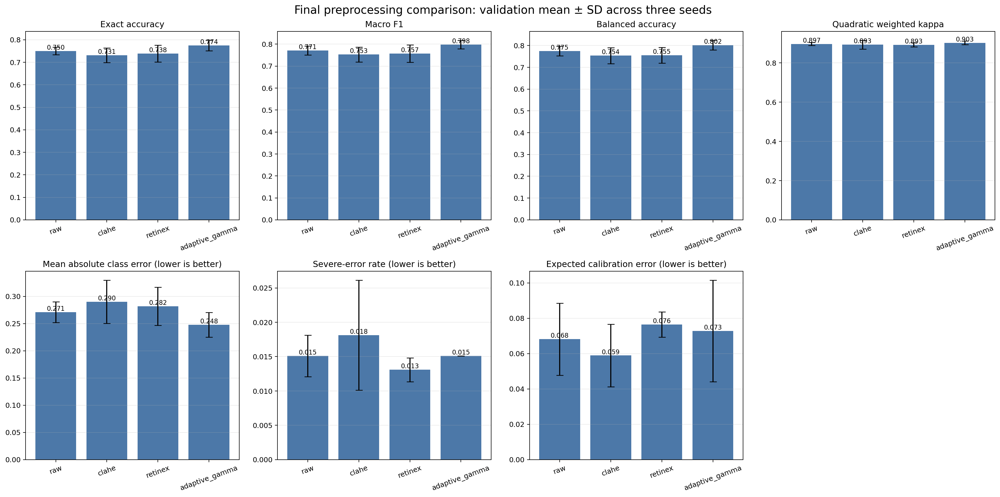

# PoreCondition-Bench

**A Reproducible Deep Learning Benchmark for Facial Pore-Condition
Preprocessing**

[](https://www.python.org/)
[](LICENSE)
[](#intended-use-and-limitations)

A reproducible deep-learning pipeline for studying how deterministic image
preprocessing affects **five-class ordinal facial pore-condition
classification**. The controlled comparison uses raw RGB, luminance CLAHE,
multi-scale Retinex, and adaptive gamma correction with the same ConvNeXt-Tiny
training protocol.

This is **not** a dry/oily/combination skin-type classifier and is not a
clinical diagnostic system.

## Main result

On the locked validation split, adaptive gamma correction produced the highest
observed three-seed mean exact accuracy:

| Method | Exact accuracy | Macro F1 | Balanced accuracy | QWK | Ordinal MAE |
|---|---:|---:|---:|---:|---:|
| Adaptive gamma | **0.774 ± 0.023** | **0.798** | **0.802** | **0.903** | **0.248** |
| Raw RGB | 0.750 ± 0.017 | 0.771 | 0.775 | 0.897 | 0.271 |
| Retinex | 0.738 ± 0.037 | 0.757 | 0.755 | 0.893 | 0.282 |
| CLAHE | 0.731 ± 0.032 | 0.753 | 0.754 | 0.893 | 0.290 |

Values are validation means across seeds 42, 123, and 2026; `±` is the sample
standard deviation for exact accuracy. Adaptive gamma improved mean exact
accuracy over raw RGB by 2.42 percentage points, but the cluster-bootstrap 95%
interval was `[-0.10, 4.93]` percentage points and crossed zero. The result is
therefore promising, not conclusive. The untouched test split has **not** been
evaluated.



Full aggregate outputs are in [`results/validation`](results/validation).

## Study design

- Dataset: 3,086 facial skin-patch images in five ordered pore-condition
  classes: `very_good`, `good`, `normal`, `poor`, and `very_poor`.
- Audit: 851 duplicate images and 10 label-conflict images were excluded,
  leaving 2,225 samples.
- Split: 1,559 train / 331 validation / 335 held-out test.
- Leakage control: rotation-canonical 64-bit dHash; exact perceptual duplicates
  are removed and near-neighbour groups (Hamming distance ≤ 2) stay in one
  split.
- Model: ImageNet-pretrained ConvNeXt-Tiny.
- Training: 35 epochs maximum, early stopping patience 7, head LR `3e-4`,
  backbone LR `3e-5`, weight decay `1e-4`, square-root-balanced cross entropy,
  label smoothing `0.05`.
- Replication: four methods × three paired seeds.
- Enhanced images: cached as verified-lossless PNG files to avoid repeating
  expensive Retinex processing.
- Selection: best validation exact accuracy. The test set remains locked until
  the protocol and interpretation are frozen.

See [Methodology](docs/METHODOLOGY.md) and
[Reproducibility](docs/REPRODUCIBILITY.md) for details.

## Dataset access

The study uses Čedomir Vasić's Zenodo record:

> *Dataset used to train a Convolutional Neural Network dedicated to skin pore
> detection and classification* (2023), DOI:
> [10.5281/zenodo.8228942](https://doi.org/10.5281/zenodo.8228942).

The record's files are restricted and access is granted on reasonable request
for scientific research. This repository intentionally contains no dataset
images, derived face grids, or trained weights.

After obtaining access, arrange the extracted data as:

```text
data/pore_data_set_224/
├── 1/  # very_good
├── 2/  # good
├── 3/  # normal
├── 4/  # poor
└── 5/  # very_poor
```

Do **not** republish this dataset on Kaggle or elsewhere unless the data owner
has explicitly granted redistribution rights in writing. A Kaggle **code
notebook** may point to a privately attached copy, but the image files should
not be made public without permission. See [Dataset notes](docs/DATASET.md).

## Installation

Python 3.10 or newer is required. A CUDA-enabled GPU is strongly recommended.

```bash
git clone <YOUR-GITHUB-REPOSITORY-URL>
cd porecondition-bench
python -m venv .venv
source .venv/bin/activate
python -m pip install --upgrade pip
python -m pip install -e .
```

For tests and linting:

```bash
python -m pip install -e ".[dev]"
pytest
ruff check .
```

PyTorch installation varies by CUDA version. If necessary, install the
appropriate PyTorch wheel from
[pytorch.org](https://pytorch.org/get-started/locally/) before installing this
package.

## Running the pipeline

Preview every command without starting computation:

```bash
pore-pipeline --config configs/final_protocol.json --dry-run
```

Run the complete validation study:

```bash
pore-pipeline --config configs/final_protocol.json
```

Resume interrupted runs:

```bash
pore-pipeline --config configs/final_protocol.json --resume
```

Run selected stages:

```bash
pore-pipeline \
  --config configs/final_protocol.json \
  --stages prepare audit cache

pore-pipeline \
  --config configs/final_protocol.json \
  --stages train report summarize \
  --resume
```

For a fast integration check, use `configs/smoke_protocol.json`. It processes
only two batches per split and is not a scientific experiment.

The final test may be evaluated once, after all choices are frozen:

```bash
pore-pipeline \
  --config configs/final_protocol.json \
  --stages report summarize \
  --evaluate-test
```

`--evaluate-test` is deliberately explicit. Do not use test feedback for model
or preprocessing selection.

## Colab

[`colab/run_pipeline_colab.ipynb`](colab/run_pipeline_colab.ipynb) is a thin
launcher: it clones the repository, installs the package, checks the expected
dataset layout in Google Drive, and invokes the same Python pipeline. Training
logic remains in `src/`, so local and Colab execution use the same code.

On the A100 run reported here, cache creation took 8.4 minutes, training took
32.0 minutes, reports took 3.1 minutes, and the complete workflow took about
43.6 minutes. Runtime will be substantially longer on lower-tier GPUs.

## Repository layout

```text
.
├── configs/                     # Frozen final and smoke protocols
├── colab/                       # Thin Colab launcher
├── docs/                        # Data, methods, results, ethics
├── results/validation/          # Shareable aggregate validation artifacts
├── scripts/                     # Source-tree launcher
├── src/pore_assessment/         # Reusable Python pipeline
├── tests/                       # Unit tests
├── pyproject.toml
└── README.md
```

Generated manifests, caches, predictions, checkpoints, and local reports are
ignored by Git. This keeps restricted or identifying image paths and large
binary artifacts out of the repository.

## Intended use and limitations

This repository supports methodological research and education. Its labels
describe dataset-specific visible pore condition, not diagnosis, skin disease,
hydration, sebum level, or overall skin type. Limitations include a small
single-source dataset, unknown demographic/device coverage, possible remaining
near-duplicates, validation-based model selection, only three random seeds, and
no external or clinical validation. Results must not be used for patient care
or automated treatment decisions.

See [Ethics and limitations](docs/ETHICS.md) and
[Results interpretation](docs/RESULTS.md).

## Citation

If you use this code, cite both this repository (after replacing the placeholder
metadata in [`CITATION.cff`](CITATION.cff)) and the original Zenodo dataset.
Complete the [release checklist](docs/RELEASE_CHECKLIST.md) before the first
public push.

## License

The source code is released under the [MIT License](LICENSE). The dataset and
any trained weights are separate works and are **not** covered by this code
license.
# skin-pore-condition-bench
